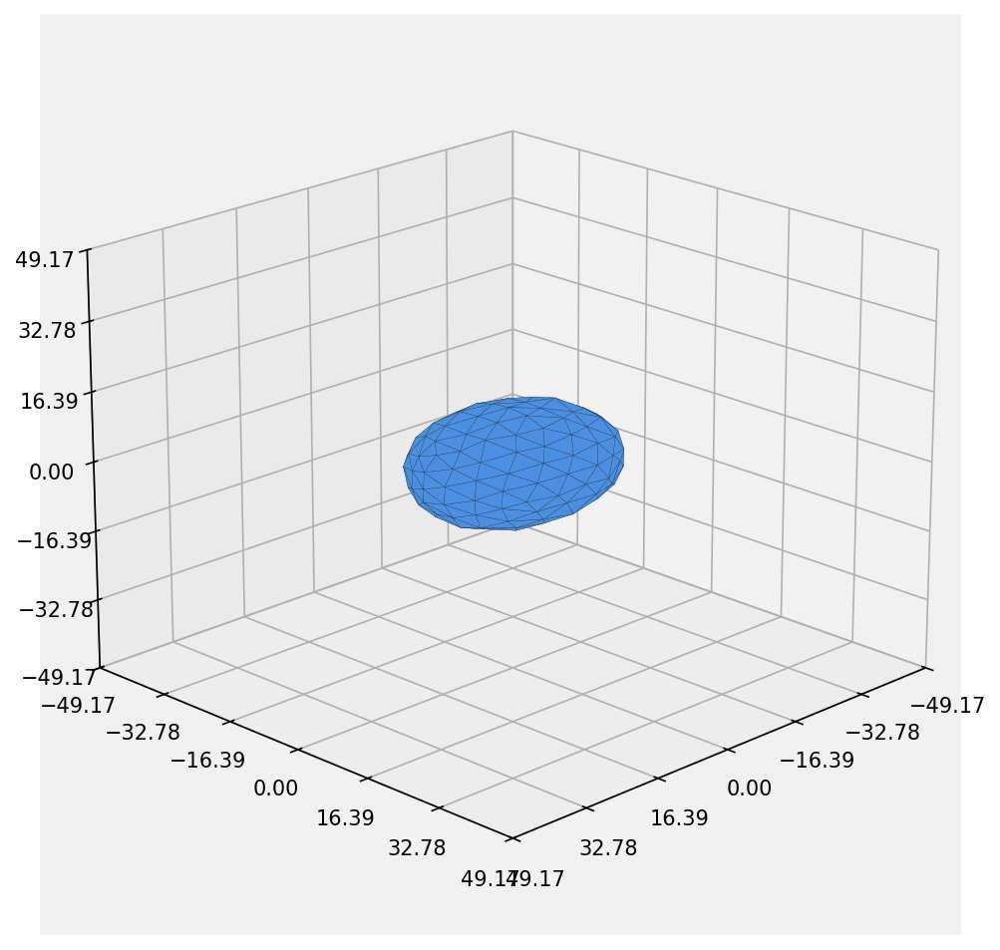
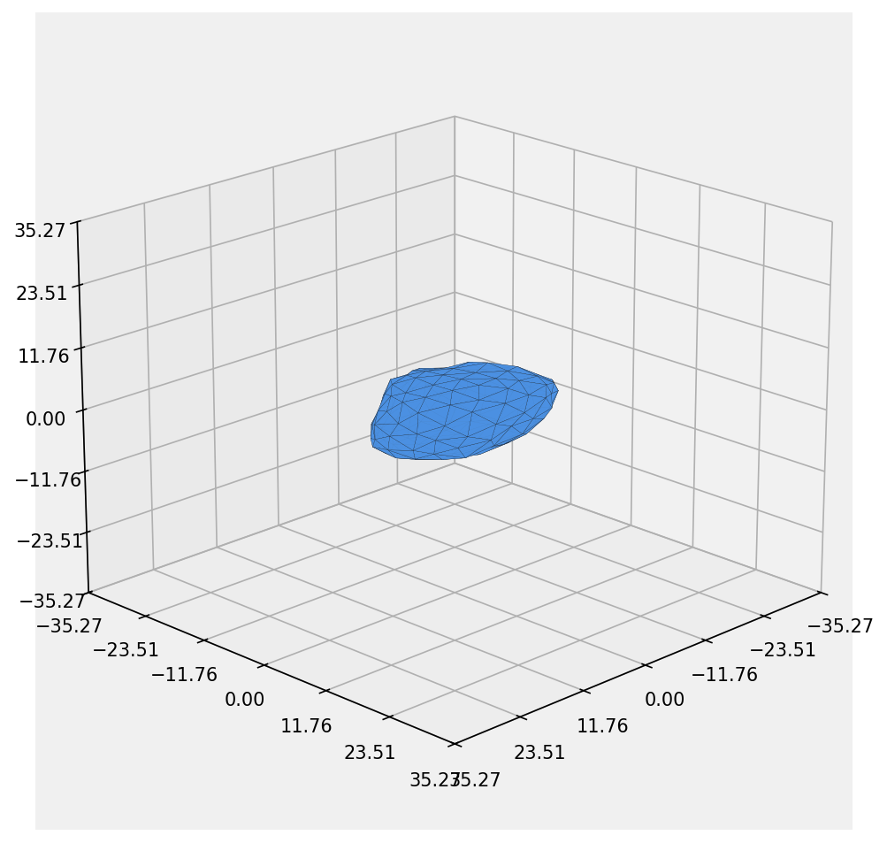
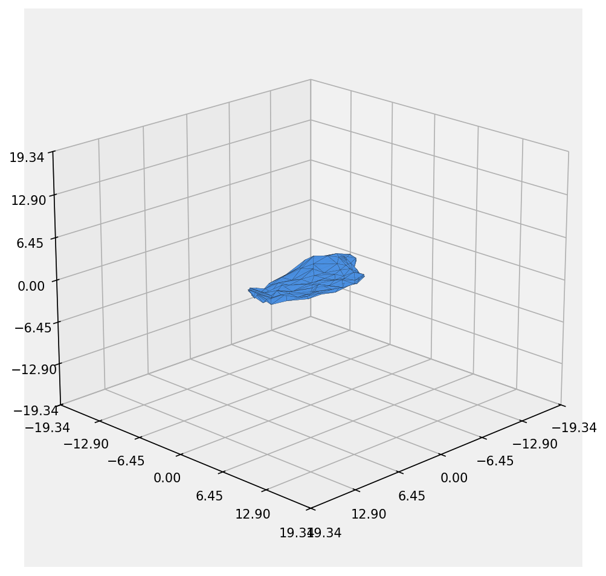

# SHPSG - Spherical Harmonics Particle Shape Generator
# SHPSG - 球谐函数粒子形状生成器


> **声明：** 本仓库仅用于2026 哈尔滨工业大学（深圳）弘理杯数学建模竞赛，基础项目是：[budizhao/SHPSG](https://github.com/budizhao/SHPSG)，非商业用途。

> **Disclaimer:** This repository is solely for the 2026 Harbin Institute of Technology (Shenzhen) Mathematical Modeling Contest. The underlying project is [budizhao/SHPSG](https://github.com/budizhao/SHPSG), and it is for non-commercial use only.
---

## What This Tool Does
## 本工具的功能

Generate highly realistic **irregular particles** for packing simulations.

为堆积模拟生成高度逼真的**不规则粒子**。

### Three Core Capabilities
### 三个核心能力

| Capability | Parameter | Range | Effect |
|------------|-----------|-------|--------|
| **1. Form Control** | Ei, Fi | 0.4-0.9 | Control particle elongation and flatness (create non-spherical shapes) |
| **2. Roundness** | D2_8 | 0.0-0.35 | Generate angular features and macroscopic protrusions |
| **3. Roughness** | D9_15 | 0.0-0.25 | Add surface texture and microscopic irregularities |

| 能力 | 参数 | 范围 | 效果 |
|------|------|------|------|
| **1. 形态控制** | Ei, Fi | 0.4-0.9 | 控制粒子拉长度和扁平度（产生非球形形状） |
| **2. 圆角度** | D2_8 | 0.0-0.35 | 生成棱角特征和宏观突起 |
| **3. 粗糙度** | D9_15 | 0.0-0.25 | 添加表面纹理和微观不规则性 |

### Additional Features

- **Particle Size:** 30-90 micrometers
- **Batch Generation:** 50 particles with automatic gradual transition (smooth → extreme)
- **Output:** 3D models (.stl), visualizations (.png), metadata (txt)
- **Gradual Progression:** 5 groups showing shape evolution from spherical to extremely strange

### 其他特征

- **粒子尺寸：** 30-90 微米
- **批量生成：** 50 个粒子，自动渐变过度（光滑 → 极端）
- **输出：** 3D 模型 (.stl)、可视化 (.png)、元数据 (txt)
- **渐变进展：** 5 组粒子，展示从球形到极度奇怪的形状演变

---

## Quick Start: 3 Steps
## 快速开始：3 步

### Step 1: Environment Setup
### 步骤 1：环境设置
```bash
pip install numpy scipy matplotlib
```

### Step 2: Run Generator
### 步骤 2：运行生成器

```bash
python run_competition_generation.py
```

main.py comes from [budizhao/SHPSG](https://github.com/budizhao/SHPSG), which can be used to understand the logic of the code.

main.py是来自[budizhao/SHPSG](https://github.com/budizhao/SHPSG)的，可以使用它来理解代码的逻辑。

### Step 3: Input Parameters
### 步骤 3：输入参数
```
Enter number of particles to generate (default: 50):
>> Press Enter to use default, or type a number

输入要生成的粒子数（默认：50）：
>> 按 Enter 使用默认值，或输入一个数字
```

**That's it!** Generated files appear in `./data/competition_particles/`

**就这样！** 生成的文件出现在 `./data/competition_particles/`

---

## Output Files
## 输出文件

For 50 particles:
- `particle_0000.stl` to `particle_0049.stl` ― 3D models for simulation
- `particle_0000.png` to `particle_0049.png` ― Visual previews
- `metadata.txt` ― All particle parameters and statistics

生成 50 个粒子：
- `particle_0000.stl` 到 `particle_0049.stl` ― 用于模拟的 3D 模型
- `particle_0000.png` 到 `particle_0049.png` ― 视觉预览
- `metadata.txt` ― 所有粒子参数和统计信息

**Example Output Statistics:**
**输出统计示例：**
```
Generation Results:
  Total particles created:  50
  Success rate:             100.0%

Batch Statistics:
  Average particle size:    59.58 micrometers
  Size range:               31.70 - 89.78 micrometers
  Average elongation (Ei):  0.656 (gradual from ~0.9 to ~0.4)
  Average flatness (Fi):    0.637 (gradual from ~0.9 to ~0.4)
  Average angularity:       0.171 (gradual from ~0.05 to ~0.3)
  Average roughness:        0.122 (gradual from ~0.01 to ~0.25)

生成结果：
  创建的粒子总数：        50
  成功率：               100.0%

批次统计：
  平均粒子尺寸：        59.58 微米
  尺寸范围：            31.70 - 89.78 微米
  平均拉长度 (Ei)：     0.656（从 ~0.9 到 ~0.4 的渐变）
  平均扁平度 (Fi)：     0.637（从 ~0.9 到 ~0.4 的渐变）
  平均棱角度：          0.171（从 ~0.05 到 ~0.3 的渐变）
  平均粗糙度：          0.122（从 ~0.01 到 ~0.25 的渐变）
```

---

## Gradual Morphology Transition
## 渐变形态过度

The script automatically generates 50 particles with **stepped progression** from regular to extremely strange:

脚本自动生成 50 个粒子，呈**阶梯式进展**，从规则到极度奇怪：

### 5 Groups of 10 Particles Each
### 每组 10 个粒子的 5 组

| Group | Particles | Form | Angularity | Roughness | Description |
|-------|-----------|------|-----------|-----------|-------------|
| **0** | 0-9 | Ei~0.9 , Fi~0.9 | D2_8~0.05 | D9_15~0.01 | Near-spherical, smooth surface |
| **1** | 10-19 | Ei~0.75 , Fi~0.75 | D2_8~0.12 | D9_15~0.07 | Slightly deformed, moderate angularity |
| **2** | 20-29 | Ei~0.65 , Fi~0.65 | D2_8~0.18 | D9_15~0.13 | Moderately strange, increased roughness |
| **3** | 30-39 | Ei~0.55 , Fi~0.55 | D2_8~0.25 | D9_15~0.19 | Highly irregular, high roughness |
| **4** | 40-49 | Ei~0.4 , Fi~0.4 | D2_8~0.30 | D9_15~0.25 | Extremely strange, maximum complexity |

| 组 | 粒子 | 形态 | 棱角度 | 粗糙度 | 描述 |
|----|------|------|---------|---------|------|
| **0** | 0-9 | Ei~0.9 , Fi~0.9 | D2_8~0.05 | D9_15~0.01 | 近球形，光滑表面 |
| **1** | 10-19 | Ei~0.75 , Fi~0.75 | D2_8~0.12 | D9_15~0.07 | 轻微变形，中等棱角 |
| **2** | 20-29 | Ei~0.65 , Fi~0.65 | D2_8~0.18 | D9_15~0.13 | 中等奇怪，增加粗糙度 |
| **3** | 30-39 | Ei~0.55 , Fi~0.55 | D2_8~0.25 | D9_15~0.19 | 高度不规则，高粗糙度 |
| **4** | 40-49 | Ei~0.4 , Fi~0.4 | D2_8~0.30 | D9_15~0.25 | 极度奇怪，最大复杂度 |

### Visual Progression: 5 Groups
### 视觉进展：5 组

**Group 0 (Regular)**  
**第 0 组（常规）**


**Group 1 (Slightly Deformed)**  
**第 1 组（轻微变形）**


**Group 2 (Moderately Strange)**  
**第 2 组（中等奇怪）**


**Group 3 (Highly Irregular)**  
**第 3 组（高度不规则）**


**Group 4 (Extremely Strange)**  
**第 4 组（极度奇怪）**


### Gradual Transition Mathematics
### 渐变过度数学

**Form Parameters (Ei, Fi):**
**形态参数 (Ei, Fi)：**
$$Ei = 0.9 - k \times (0.9 - 0.4)$$
$$Fi = 0.9 - k \times (0.9 - 0.4)$$

**Roundness (D2_8):**
**圆角度 (D2_8)：**
$$D_{2\_8} = 0.05 + k \times (0.3 - 0.05)$$

**Roughness (D9_15):**
**粗糙度 (D9_15)：**
$$D_{9\_15} = 0.0 + k \times 0.25$$

where $k = group / 4.0$ (0.0 to 1.0)

其中 $k = group / 4.0$ （0.0 到 1.0）

---

## Parameter Customization
## 参数自定义

### Modify Global Parameters
### 修改全局参数

Edit the parameter ranges in `particle_generator.py`:

编辑 `particle_generator.py` 中的参数范围：

```python
# In generate_random_particle_params() function
'Ei': np.random.uniform(0.4, 0.9),      # Change elongation range
'Fi': np.random.uniform(0.4, 0.9),      # Change flatness range
'D2_8': np.random.uniform(0.2, 0.45),   # Change angularity range
'D9_15': np.random.uniform(0.08, 0.25), # Change roughness range
```

### Disable Gradual Transition (Use Random)
### 禁用渐变过度（使用随机）

To generate particles without gradual transition, modify the call:

要生成没有渐变过度的粒子，请修改调用：
```python
# In batch_generate_particles() at line ~160
params = generate_random_particle_params()  # Without particle_index
```

### Generate Only STL (No PNG)
### 仅生成 STL（无 PNG）

Edit `run_competition_generation.py`, line ~280:

编辑 `run_competition_generation.py` 的第 ~280 行：
```python
particles, failed = enhanced_batch_generate_particles(
    num_particles=num_particles,
    output_dir=output_dir,
    include_png=False,  # Change to False
    verbose=True
)
```

---

## Advanced Usage
## 高级用法

### Reproducible Results
### 可重复结果

Add at top of script:

在脚本顶部添加：
```python
import numpy as np
np.random.seed(42)  # Fix random seed
```

### Generate Single Particle
### 生成单个粒子

```python
from SHPSG import SHPSG
from funcs import sh2stl, plotstl, icosahedron, subdivsurf, cleanmesh, car2sph

# Setup geometry
vertices, faces = icosahedron()
for i in range(2):
    vertices, faces = subdivsurf(faces, vertices)
    vertices, faces = cleanmesh(faces, vertices)
sph_cor = car2sph(vertices)

# Create and save particle (Ei=0.5, Fi=0.5, D2_8=0.3, D9_15=0.2, 60 micrometers)
coeff = SHPSG(Ei=0.5, Fi=0.5, D2_8=0.3, D9_15=0.2)
vertices_copy = vertices.copy()
sh2stl(coeff, sph_cor, vertices_copy, faces, 'my_particle.stl', D_eq=60.0)
plotstl('my_particle.stl', 'my_particle.png', D_eq=60.0)
```

### Generate Mixed Batch (Regular + Weird)
### 生成混合批次（常规 + 奇怪）

```python
from particle_generator import batch_generate_mixed_particles

# Generate 40 regular + 10 weird particles
particles = batch_generate_mixed_particles(
    output_dir='./Output_Batch',
    regular_count=40,
    weird_count=10,
    include_png=True,
    verbose=True
)
```

**Regular Particles:** Realistic rock shapes (Ei~0.8-1.0, Fi~0.7-0.95)  
**常规粒子：** 逼真的岩石形状 (Ei~0.8-1.0, Fi~0.7-0.95)

**Weird Particles:** Extreme spikes/concavities (Ei~0.2-0.5, Fi~0.1-0.4)  
**奇怪粒子：** 极端尖刺/凹陷 (Ei~0.2-0.5, Fi~0.1-0.4)

---

## Technical Details
## 技术细节

### Core Implementation
### 核心实现

**File:** `particle_generator.py`

**Key Functions:**
**关键函数：**
- `generate_random_particle_params()` ― Generate morphological parameters (with optional gradual transition)
- `generate_random_particle_params()` ― 生成形态参数（支持可选的渐变过度）
- `batch_generate_particles()` ― Generate batch with STL/PNG output
- `batch_generate_particles()` ― 生成 STL/PNG 输出的批次
- `batch_generate_mixed_particles()` ― Generate mixed regular/weird batch
- `batch_generate_mixed_particles()` ― 生成混合常规/奇怪批次

**Parameters:**
**参数：**
- `particle_index` ― Enables gradual transition mode when provided
- `particle_index` ― 当提供时启用渐变模式
- `max_degree` ― SH expansion degree (8-16, default 16)
- `max_degree` ― SH 扩展度（8-16，默认 16）
- `coeff_multiplier` ― Coefficient scaling factor (1.0-10.0)
- `coeff_multiplier` ― 系数缩放因子（1.0-10.0）

### Spherical Harmonics Expansion
### 球谐函数展开

- **Degree:** Extended from 9 to 16 (original to enhanced)
- **度数：** 从 9 扩展到 16（原始到增强）
- **Coefficients:** 81 (degree 9) → 256 (degree 16)
- **系数：** 81 (9 阶) → 256 (16 阶)
- **Resolution:** 3 complex numbers per degree = 256×3 complex matrix
- **分辨率：** 每度 3 个复数 = 256×3 复数矩阵

### Mesh Geometry
### 网格几何

- **Base:** Icosahedron (20 faces)
- **基础：** 正二十面体（20 个面）
- **Subdivision:** 2 levels (20 → 80 → 320 faces)
- **细分：** 2 个级别（20 → 80 → 320 个面）
- **Coordinates:** Spherical (r, θ, φ) for SH compatibility
- **坐标：** 球面坐标 (r, θ, φ) 用于 SH 兼容性
- **Pre-computation:** Single mesh geometry reused for all particles
- **预计算：** 单个网格几何为所有粒子重复使用

### Performance
### 性能

- Mesh setup: ~2-3 seconds (one-time)
- 网格设置：~2-3 秒（一次性）
- Per particle STL: <0.1 seconds
- 每个粒子 STL：<0.1 秒
- Per particle PNG: ~3 seconds
- 每个粒子 PNG：~3 秒
- Full batch (50 particles): ~150-160 seconds
- 完整批次（50 个粒子）：~150-160 秒

---

## File Structure
## 文件结构

```
SHPSG/
├── README.md                           (This file - complete guide)
│                                       (本文件 - 完整指南)
├── run_competition_generation.py       (Main script - use this!)
│                                       (主脚本 - 使用这个！)
├── particle_generator.py               (Batch generation functions)
│                                       (批生成函数)
├── generate_mixed_batch.py             (Mixed batch generation script)
│                                       (混合批生成脚本)
├── SHPSG.py                            (Core SH algorithm)
│                                       (核心 SH 算法)
├── funcs.py                            (Utilities: sh2stl, plotstl, etc.)
│                                       (实用工具：sh2stl, plotstl 等)
├── main.ipynb                          (Jupyter notebook example)
│                                       (Jupyter 笔记本示例)
├── requirements.txt                    (Python dependencies)
│                                       (Python 依赖)
├── verify_modifications.py             (Verification script)
│                                       (验证脚本)
└── data/
    ├── competition_particles/          (Default output folder)
    │                                   (默认输出文件夹)
    │   ├── particle_*.stl
    │   ├── particle_*.png
    │   └── metadata.txt
    ├── demo_particles/                 (Example outputs)
    │                                   (示例输出)
    └── test_interactive/               (Test outputs)
                                        (测试输出)
```

---

## Common Questions
## 常见问题

**Q: How long does it take to generate 50 particles?**  
**问：生成 50 个粒子需要多长时间？**  
A: ~2-3 minutes (includes STL generation and PNG visualization)  
答：~2-3 分钟（包括 STL 生成和 PNG 可视化）

**Q: Can I change the number of particles?**  
**问：我可以改变粒子的数量吗？**  
A: Yes! Enter a different number when prompted (or modify `num_particles` in script)  
答：可以！在提示时输入不同的数字（或修改脚本中的 `num_particles`）

**Q: What if I want only STL files without PNG?**  
**问：如果我只想要 STL 文件而不要 PNG 怎么办？**  
A: Edit `run_competition_generation.py` and set `include_png=False`  
答：编辑 `run_competition_generation.py` 并设置 `include_png=False`

**Q: How do I use these particles in simulation software?**  
**问：如何在模拟软件中使用这些粒子？**  
A: Import the .stl files directly into DEM software (Yade, LIGGGHTS, etc.) or CAD programs  
答：直接将 .stl 文件导入 DEM 软件（Yade、LIGGGHTS 等）或 CAD 程序

**Q: Can I fix a random seed for reproducibility?**  
**问：我可以固定随机种子以保证可重复性吗？**  
A: Yes! Add `np.random.seed(42)` at the top of the generation script  
答：可以！在生成脚本的顶部添加 `np.random.seed(42)`

**Q: What if I want particles with specific properties?**  
**问：如果我想要具有特定属性的粒子怎么办？**  
A: Edit parameter ranges in `generate_random_particle_params()` or use `generate_random_particle_params(particle_index=5, total_particles=50)` for gradual transition  
答：编辑 `generate_random_particle_params()` 中的参数范围，或使用 `generate_random_particle_params(particle_index=5, total_particles=50)` 进行渐变过度

**Q: How do I change from gradual transition to fully random?**  
**问：如何从渐变过度改为完全随机？**  
A: Change `generate_random_particle_params(particle_index=i, total_particles=num_particles)` to `generate_random_particle_params()`  
答：将 `generate_random_particle_params(particle_index=i, total_particles=num_particles)` 改为 `generate_random_particle_params()`

**Q: Can I generate more than 100 particles?**  
**问：我能生成 100 个以上的粒子吗？**  
A: Yes! The script supports any number. Just edit `num_particles` value  
答：可以！脚本支持任意数量。只需编辑 `num_particles` 值

**Q: What's the difference between regular and weird particles?**  
**问：常规粒子和奇怪粒子有什么区别？**  
A: Regular: realistic rock shapes (Ei~0.8-1.0, low angularity). Weird: extreme shapes with spikes/hollows (Ei~0.2-0.5, high angularity)  
答：常规：逼真的岩石形状（Ei~0.8-1.0，低棱角）。奇怪：具有尖刺/凹陷的极端形状（Ei~0.2-0.5，高棱角）

---

## Enhancement Summary
## 增强功能总结

### Original SHPSG Features Preserved
### 保留的原始 SHPSG 特征
- ? Spherical harmonics core algorithm
- ? 球谐函数核心算法
- ? STL export capability
- ? STL 导出功能
- ? 3D visualization (plotstl)
- ? 3D 可视化 (plotstl)
- ? Full backward compatibility
- ? 完全向后兼容

### New Features Added
### 添加的新功能
- ? Extended SH to degree 16 (256 coefficients)
- ? SH 扩展到 16 度（256 个系数）
- ? Particle size control (30-90 micrometers)
- ? 粒子大小控制（30-90 微米）
- ? Morphological parameter system (Ei, Fi, D2_8, D9_15)
- ? 形态参数系统（Ei、Fi、D2_8、D9_15）
- ? Gradual morphology transition (5 groups)
- ? 渐变形态过度（5 组）
- ? Batch generation system (50-100 particles)
- ? 批量生成系统（50-100 粒子）
- ? Mixed morphology (regular + weird)
- ? 混合形态（常规 + 奇怪）
- ? PNG visualization
- ? PNG 可视化
- ? Comprehensive metadata export
- ? 综合元数据导出
- ? Interactive command-line interface
- ? 交互式命令行界面

---

## Support & Documentation
## 支持和文档

**Quick References:**
**快速参考：**
- **Setup Time:** 2 minutes (Python dependencies)
- **设置时间：** 2 分钟（Python 依赖）
- **First Run:** 5 minutes (understand the tool)
- **首次运行：** 5 分钟（了解工具）
- **Full Batch:** 2-3 minutes (50 particle generation)
- **完整批次：** 2-3 分钟（50 粒子生成）

---

## Version History
## 版本历史

- **v2.0 (2026-01-21):** Gradual transition feature added, complete documentation consolidation
- **v2.0 (2026-01-21)：** 添加了渐变过度功能，完成了文档整合
- **v1.5:** Enhanced parameter control and mixed morphology support
- **v1.5：** 增强的参数控制和混合形态支持
- **v1.0:** Initial release with extended SH and batch generation
- **v1.0：** 扩展 SH 和批量生成的初始版本

---

**Last Updated:** 2026-01-21  
**最后更新：** 2026-01-21  
**Status:** Ready for 2026 Hongli Cup Mathematical Modeling Competition